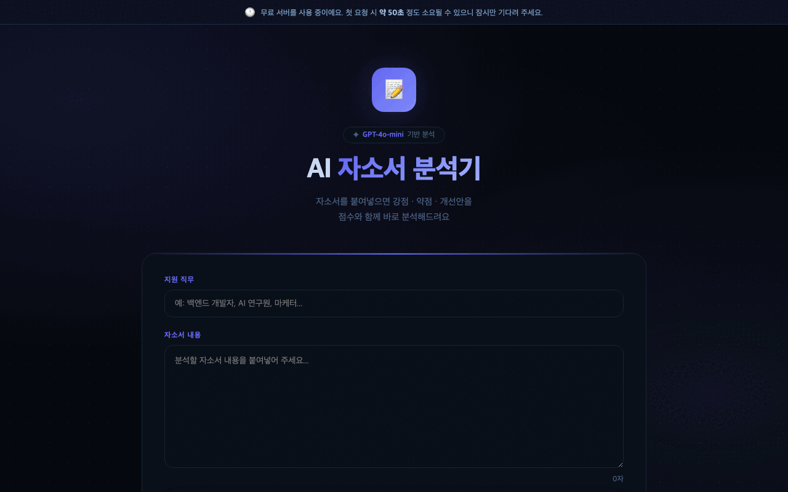

# 📝 Cover Letter Analyzer

> GPT-4o-mini 기반 자기소개서 분석 및 피드백 시스템

자기소개서와 지원 직무를 입력하면 AI가 점수 채점, 강점/약점 분석, 개선 제안까지 한 번에 제공합니다.

## 📸 Demo



## 🛠️ 기술 스택

| 분류 | 기술 |
|------|------|
| LLM | OpenAI GPT-4o-mini |
| Backend | FastAPI |
| Frontend | Vanilla JS |
| Deploy | Render |

## 🚀 실행 방법

```bash
git clone https://github.com/sauuri/cover-letter-analyzer
cd cover-letter-analyzer
python3 -m venv .venv
source .venv/bin/activate
pip install -r requirements.txt
cp .env.example .env
# .env 파일에 OPENAI_API_KEY 입력
uvicorn app.main:app --reload
```

브라우저에서 `http://localhost:8000` 열기

## 🔗 Live Demo

[https://cover-letter-analyzer.onrender.com](https://cover-letter-analyzer.onrender.com)
